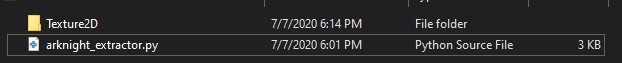
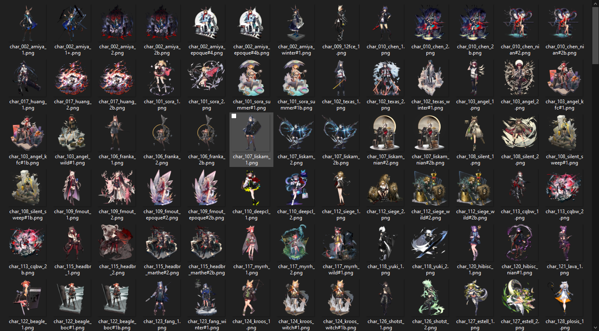

# ArknightImageExtractor
## 明日方舟 立绘提取 + 合并


## "食用"方法
1. 使用[AssetStudio](https://www.perfare.net/1194.html)提取明日方舟charpack文件
2. 将此程序放在与Texture2D同文件夹下



3. 运行
```
python3 arknight_extractor.py
```

## Demo


## TODO
语音提取，live2d小人提取,  角色台词提取， npc素材提取， 地图提取， 家具提取...

## 版权相关
素材版权均鹰角所有，此程序仅供学习使用，请勿商用。

## License
© [Darkspirit2017](https://github.com/Darkspirit2017/ArknightImageExtrator), Released under the [MIT](https://github.com/Darkspirit2017/ArknightImageExtrator/blob/master/LICENSE) License.

